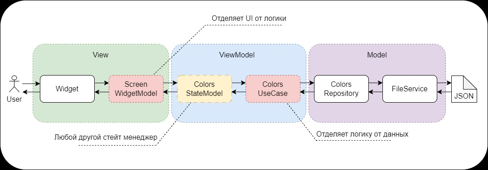
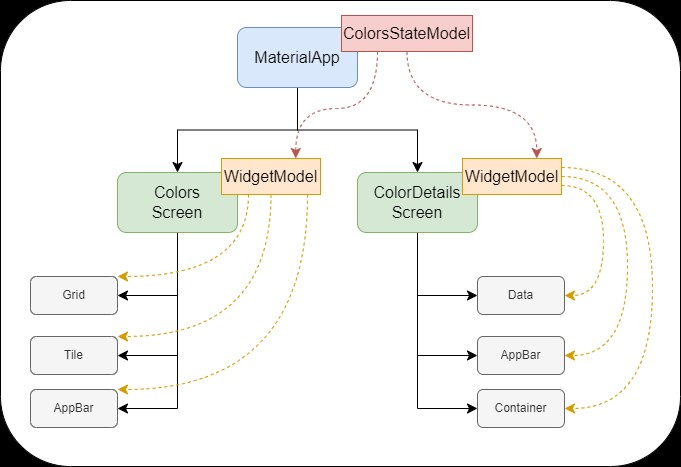

# Description of your result

Выполнение здания ```Палитра цветов```

## Description

В рамках задания создано приложение для отображения палитры цветов и просмотра информации о конкретном цвете,
с возможностью копирования его HEX значения в системный буфер обмена, с реактивным отображением информации об этом
на экране в виде иконки и уведомления. Исходные данные в приложении хранятся в виде Json файла с картой цветов.

Все приложение создано согласно принципам чистой архитектуры и SOlID, так же в приложение долблены две прослойки
для уменьшения связности и зависимости слоев.

Для уменьшения связности компонентов архитектуры добавлено внедрение зависимостей (DI), основанное на аннотационном
описании классов и автоматическом построении.

В рамках задания выполнены все поставленные условия, так же дополнительно отрефакторен код, и покрыт документированием.

## How to

Для запуска приложения в среде отладки нужно выполнить следующую последовательность действий:

- Открыть консоль в корневой директории приложения
- Вызвать команду `flutter pub get`, для подтягивания связанных пакетов
- После завершения команды вызвать `dart run build_runner build --delete-conflicting-outputs`, для запуска кодогенерации
- После завершения генерации классов и DI запускать приложение обычным способом через flutter run/debug, либо сделать
  apk файл.

## Problems

Самая большая проблема найти время на проект, при мелких и точечных подходах дольше вспоминал что, делал и что нужно сделать,
по сути приложение сделано за 2 полноценных рабочих дня. В процессе немного запутался в логике подписок и потоков, 
но потом на свежую голову все разрешилось само.

## More
В данном разделе представлена архитектура проекта с разбиением на слои


В представленной схеме показана опрокидывание провайдера и использование блоков логики в дереве виджетов.


## Demo

В проект добавил каталог ```results``, в котором разместил короткое видео с презентацией работы проекта и
изображения.

